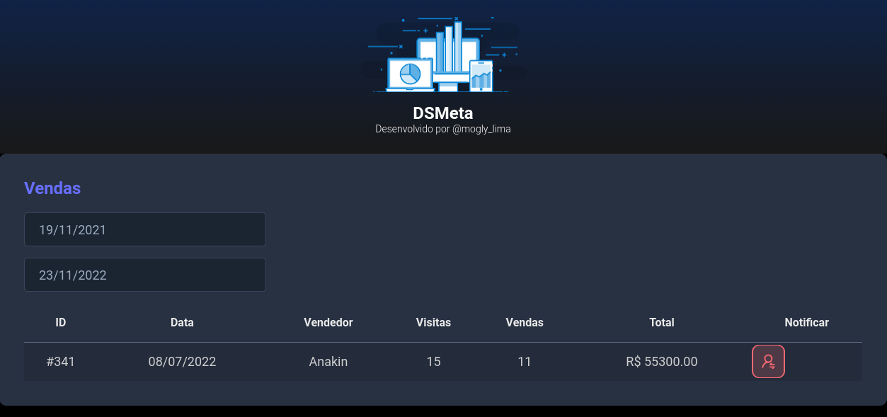
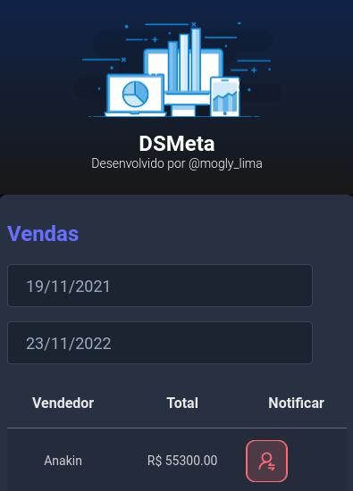

# Projeto DSMeta

> _Projeto desenvolvido durante a semana Spring React realizadada pela DevSuperior._

## Sobre o projeto

O intuito é construir uma aplicação usando Spring Boot no BackEnd e ReactJS no FrontEnd. A aplicação se trata de um sistema de visualização de dados de um departamento de vendas, abrangendo mais específicamente dados dos vendedores, tendo a possibilidade de filtragem dos dados de acordo com intervalo de tempo, enviar notificações via SMS.

## Estrutura do projeto

```
DSMeta
  ├─── backend
  ├─── frontend

```

## Tecnologias utilizadas

- Java
- Spring Boot
- javascript
- html
- css
- ReactJS
- DatePicker

## Layout web



## Layout mobile



## OBS

Nas pastas referente ao frontend e backend, há um arquivo README.md com mais informações sobre cada parte do projeto.
